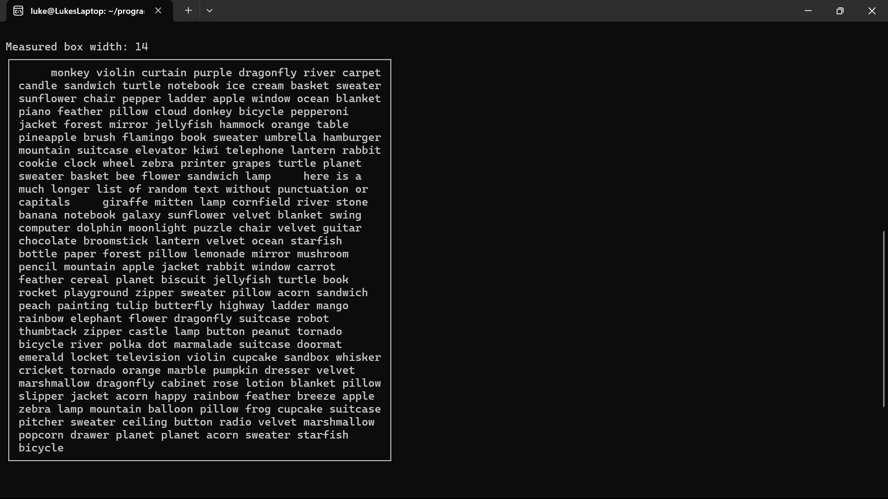

# sysmess

Fancy terminal message box renderer using Unicode box characters and ANSI styling.

Uses a dynamic string buffer for quick and snappy message rendering.

## Installation & Building

  ### Install Via PIP (Recomended)
  ```bash
  pip install sysmess
  ```

  ### Build From Source
  - Clone the repository `git clone https://github.com/canadaluke888/sysmess.git`

  - Build the extension in-place:

    `python3 setup.py build` (MacOS & Linux)

    `python setup.py build` (Windows)

    

  - (Optional) Install into your current environment:
  
    1. Make a virtual environment: `python3 -m venv .venv` (MacOS & Linux) | `python -m venv .venv` (Windows)

    2. Activate virtual environment: `source .venv/bin/activate` (MacOS & Linux) | `.venv/Scripts/Activate` (Windows)

    3. Install into current environment:

        ```bash
        pip install .
        ```

## Usage

```python
import sysmess

msg = sysmess.fancy_box(
    "Hello, world!",
    title="Greeting",
    center=True,
    bold=True,
    italic=False,
)
print(msg)

# Measure the width of the box (including borders)
width = sysmess.measure_box_width("Hello, world!", title="Greeting")
print(width)
```

# Use the "round" style for rounded corners
```python
msg = sysmess.fancy_box(
    "Rounded corners!",
    title="Round",
    style="round"
)
print(msg)
```

You can also specify colors for the border, title, and body:

```python
msg = sysmess.fancy_box(
    "Colored message",
    title="Colorful",
    border_color="magenta",
    title_color="cyan",
    body_color="yellow"
)
print(msg)
```

Supported color names:

| Basic colors | Bright colors |
| ------------ | ------------- |
| black        | bright_black  |
| red          | bright_red    |
| green        | bright_green  |
| yellow       | bright_yellow |
| blue         | bright_blue   |
| magenta      | bright_magenta|
| cyan         | bright_cyan   |
| white        | bright_white  |

## Word wrap & max width

By passing `wrap=True`, sysmess will wrap your message text to fit your terminal width (or a specific maximum width via `max_width`):

```python
import sysmess
long_text = "Lorem ipsum dolor sit amet, consectetur adipiscing elit..."
print(sysmess.fancy_box(long_text, wrap=True))
# Or specify a fixed max width:
print(sysmess.fancy_box(long_text, wrap=True, max_width=60))
```

## Output



## Blink support

You can make the border, title, or body text blink using the blink flags:

```python
import sysmess
print(sysmess.fancy_box("Blinking border!", blink_border=True))
print(sysmess.fancy_box("Blinking title!", title="Hey", blink_title=True))
print(sysmess.fancy_box("Blinking body text!", blink_body=True))
```

## Examples

Once built (or installed), run the demonstration script to see sample outputs:

```bash
python3 examples.py
```

## Testing

Run the unit tests using the included test runner:

```bash
python3 test.py
```
